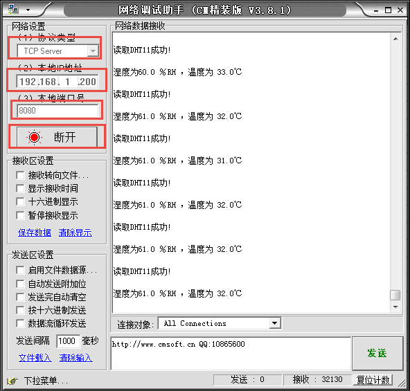

# Air Iot

> 基于指南者Stm32开发板进行开发，通过传感器感知大气质量指标，通过WIFI模块进行TCP通信，完成物联网嵌入式设备的构建。

## 技术栈

> Stm32F103芯片 + WIFI ESP8266模块 + DHT11温湿度传感器 + GP2Y灰尘传感器

## IDE 

> Keil Mdk 5 进行程序的编译烧写

> CLion 进行程序的开发

## 网络调试

1. 一可运行网络调试工具 NetAssist.exe ， 直接查看TCP接收数据信息
2. 二可运行服务端程序 **[Air-Server](https://github.com/kevinten10/Air-Server)**，完成TCP数据包的接收

## 配置说明

**请到 User/Test/test.h 配置文件中，修改WIFI账号密码 以及相关IP和端口信息** 

若要使用不同传感器模块，请到 User/Test/test.c 配置文件中，修改数据协议，并同步协议到Air-Protocol协议服务中

## 目录结构

-- 项目文件：

main.c : 启动

ESP8266 : WIFI通信模块

gp2y : 灰尘传感器

dht11 : 温湿度传感器

Test : TCP通信的函数

-- 默认文件：

usart : 输出重定向

common : 工具函数

SysTick : 系统时钟终端

## 项目开发函数

1. 获取传感器模块感知的数据：在相应模块的.c和.h文件中，根据模块使用书，根据模块的数据格式定义相关函数。

2. WIFI ESP8266 模块通过TCP与服务端通信：Test文件，定义了TCP数据包的格式，采用JSON格式进行数据字段的传输，方便服务端解析。

若采用默认设置，只需修改test.h中的需要连接的WIFI账号密码，以及服务器IP和端口地址，然后下载程序到制定开发板即可运行。

（默认IP端口地址连接到的是云服务器，若连接到云服务器，可直接登录 http://47.100.236.64:8080/air 查看数据）

## 运行流程

1. 温湿度传感器DHT11 + PM2.5传感器 连接到开发板 

    (若连接方式相同，则无需修改代码，若使用不同引脚端口，则需要在程序引脚定义部分 (相应模块的.c与.h文件) 修改为相应端口)

2. 通过Keil mdk将程序下载到开发板中

3. 启动TCP服务端或者TCP接收工具，即可查看接收到的数据包

## 设备

## 实验现象

